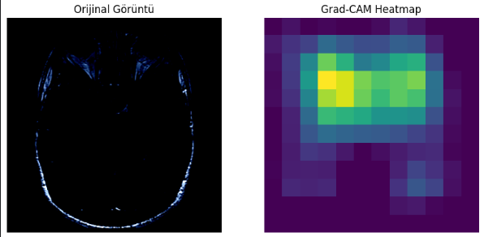
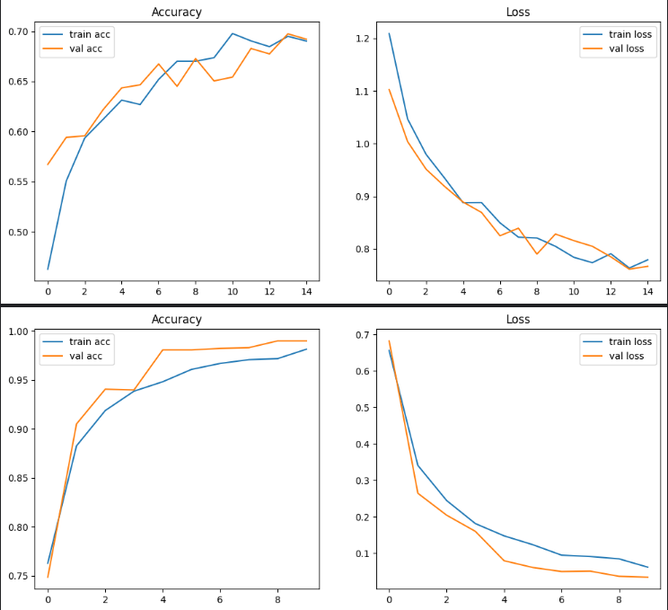
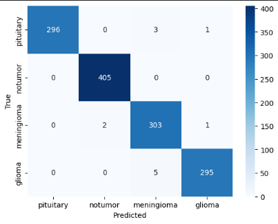

# Akbank Derin Öğrenme Bootcamp Projesi: MRI Görüntüleri ile Beyin Tümörü Sınıflandırması

Bu proje, Akbank & Global AI Hub işbirliğiyle düzenlenen Derin Öğrenme Bootcamp'i kapsamında geliştirilmiştir. Projenin amacı, beyin tümörlerini içeren Manyetik Rezonans (MR) görüntülerinden yararlanarak çok sınıflı bir sınıflandırma yapabilen, yüksek başarımlı bir Evrişimli Sinir Ağı (CNN) modeli oluşturmaktır.

 

> *Modelin, kararını verirken doğrudan tümörlü bölgeye odaklandığının Grad-CAM ile görsel kanıtı.*

---

## Projenin Amacı

Bu projenin temel amacı, verilen bir beyin MR görüntüsünü analiz ederek, görüntünün dört sınıftan hangisine ait olduğunu yüksek doğrulukla tespit edebilen bir derin öğrenme modeli geliştirmektir: **"Glioma", "Meningioma", "No Tumor"** veya **"Pituitary"**.

## Veri Seti

Projede, Kaggle üzerinde bulunan **"Brain Tumor MRI Dataset"** kullanılmıştır.

* **Veri Seti Linki:** [Brain Tumor MRI Dataset](https://www.kaggle.com/datasets/masoudnickparvar/brain-tumor-mri-dataset)
* **Toplam Görüntü Sayısı:** 7,023
* **Sınıflar (4 adet):** `glioma`, `meningioma`, `notumor`, `pituitary`

## Kullanılan Teknolojiler
Projenin geliştirilmesinde aşağıdaki kütüphaneler ve teknolojiler kullanılmıştır:
* **TensorFlow & Keras:** Derin öğrenme modelini oluşturmak, eğitmek ve değerlendirmek için.
* **EfficientNetB4:** Transfer Learning için kullanılan modern ve yüksek performanslı CNN mimarisi.
* **Albumentations:** Veri artırma (Data Augmentation) işlemleri için yüksek performanslı bir kütüphane.
* **Pandas & NumPy:** Veri manipülasyonu ve sayısal işlemler için.
* **Matplotlib & Seaborn:** Veri görselleştirme ve sonuçların sunumu için.
* **Scikit-learn:** Model değerlendirme metrikleri (Confusion Matrix, Classification Report) için.
* **Kaggle Notebooks:** Projenin geliştirildiği ve çalıştırıldığı bulut tabanlı ortam.

---

## Metodoloji

### Veri Önişleme ve Artırma (Data Augmentation)
Modelin genelleme kabiliyetini artırmak ve ezberlemeyi (overfitting) önlemek amacıyla `albumentations` kütüphanesi ile `Resize`, `HorizontalFlip`, `ShiftScaleRotate`, `RandomBrightnessContrast` ve `Normalize` gibi çeşitli dönüşümler içeren zengin bir veri artırma pipeline'ı oluşturulmuştur.

### Modelleme Yaklaşımı ve Deneyler
En iyi model mimarisini bulmak için iki aşamalı bir deney yapılmıştır:
1.  **Deney 1: Sıfırdan CNN Modeli (Başlangıç Denemesi):** İlk olarak, standart bir CNN modeli sıfırdan eğitilmiş ve **%75-%80** gibi sınırlı bir başarıya ulaşılmıştır.
2.  **Deney 2: Transfer Learning ile `EfficientNetB4` (Nihai Model):** İlk denemedeki düşük başarı üzerine, ImageNet üzerinde önceden eğitilmiş `EfficientNetB4` mimarisi ile **Transfer Learning** yaklaşımı benimsenmiştir.

### Model Eğitimi ve İnce Ayar (Fine-Tuning)
Model, en iyi performansı elde etmek için iki aşamada eğitilmiştir:
1.  **Sadece Üst Katmanların Eğitimi:** İlk aşamada, `EfficientNetB4` temel modeli dondurulmuş ve sadece özel sınıflandırıcı katmanlar eğitilmiştir.
2.  **İnce Ayar (Fine-Tuning):** İkinci aşamada, temel modelin katmanları "çözülmüş" ve tüm model, çok daha düşük bir öğrenme oranı (`1e-5`) ile yeniden eğitilmiştir.

Eğitim sürecinde `EarlyStopping` ve `ReduceLROnPlateau` gibi geri çağrılar (callbacks) kullanılarak verimlilik artırılmıştır.

---

## Elde Edilen Sonuçlar

> Proje sonucunda, doğrulama (validation) seti üzerinde **0.9900 doğruluk oranına** ulaşılmıştır.

Modelin performansı, grafikler ve metriklerle detaylı olarak incelenmiştir.

**Accuracy ve Loss Grafikleri**

*Yukarıdaki grafikler iki aşamalı eğitim sürecini göstermektedir. Üstteki iki grafik, sadece sınıflandırma katmanlarının eğitildiği ilk aşamayı; alttaki iki grafik ise tüm modelin düşük öğrenme oranıyla ince ayar (fine-tuning) yapıldığı ikinci aşamayı temsil eder. Özellikle fine-tuning aşamasında modelin doğruluğunun hızla %99 seviyelerine ulaştığı ve ezberleme yapmadan kararlı bir şekilde öğrendiği görülmektedir.*

**Karmaşıklık Matrisi (Confusion Matrix)**

*Karmaşıklık matrisi, modelin tahmin performansını sınıflar bazında göstermektedir. Matrisin köşegenindeki (diagonal) yüksek rakamlar, modelin tüm sınıfları (pituitary: 296, notumor: 405, meningioma: 303, glioma: 295) çok yüksek bir doğrulukla doğru bir şekilde sınıflandırdığını göstermektedir. Sınıflar arası karışıklık oranının çok düşük olması, modelin başarısını teyit etmektedir.*

**Model Yorumlanabilirliği (Grad-CAM)**
Projenin en önemli adımlarından biri, modelin "kara kutu" olmaktan çıkarılıp kararlarını nasıl verdiğini anlamaktır. Grad-CAM tekniği ile yapılan görselleştirmeler, modelin bir görüntüye "tümör var" teşhisi koyarken, **doğrudan görüntünün içindeki tümörlü bölgeye odaklandığını** en başta sunulan görselde net bir şekilde kanıtlamaktadır. Bu, modelin sadece doğru tahmin yapmakla kalmayıp, bunu doğru sebeplere dayanarak yaptığını göstermektedir.

---
## Sonuç ve Gelecek Çalışmalar

### Sonuç
Bu projede, beyin tümörü MR görüntülerinden dört sınıflı bir sınıflandırma problemi için yüksek başarımlı bir derin öğrenme modeli geliştirilmiştir. Transfer Learning tekniğinin, sınırlı veri setlerinde dahi ne kadar güçlü sonuçlar üretebildiği kanıtlanmıştır. 
### Gelecek Çalışmalar
Bu proje, gelecek geliştirmeler için sağlam bir temel oluşturmaktadır. Potansiyel gelecek adımları şunlar olabilir:
* **Model Çeşitliliğini Artırma:** `EfficientNet` ailesinin diğer üyeleri veya `Vision Transformer (ViT)` gibi farklı modern mimarilerle denemeler yapılarak performans karşılaştırılması yapılabilir.
* **3D Veri ile Çalışma:** Proje, MR kesitlerinin 2D görüntüleri üzerinde çalışmaktadır. Modeli, tümörün 3 boyutlu yapısını daha iyi anlayabilmesi için 3D CNN mimarileri ile tüm MR hacmini işleyecek şekilde genişletmek, potansiyel olarak daha da yüksek bir başarı sağlayabilir.
* **Web Arayüzü Geliştirme (Deployment):** Modelin gerçek dünya kullanımını simüle etmek amacıyla, doktorların veya araştırmacıların MR görüntülerini yükleyip anında sınıflandırma sonucu ve Grad-CAM haritası alabilecekleri bir `Streamlit` veya `Gradio` web arayüzü geliştirilebilir.
* **Daha Kapsamlı Veri Setleri:** Modeli, farklı hastanelerden veya farklı MR cihazlarından gelen verilerle eğiterek genelleme kabiliyetini daha da artırmak hedeflenebilir.

---

## Kaggle Notebook Linki

Projenin tüm kodlarını, analizleri ve çıktılarını içeren Kaggle notebook'una aşağıdaki linkten ulaşabilirsiniz:

**Proje Notebook'u: https://www.kaggle.com/code/clkibrahim/braintumorproject** 
